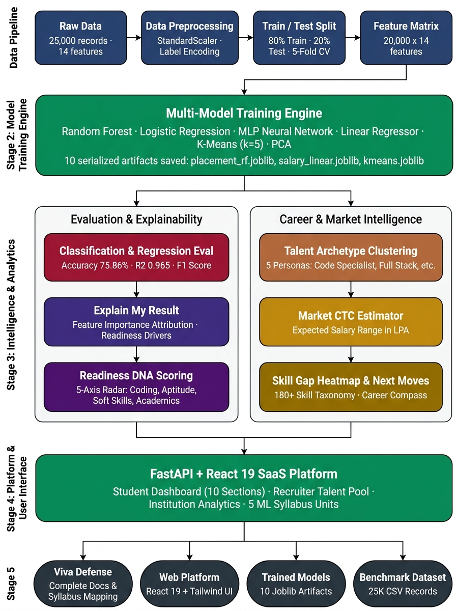

# System Architecture Documentation

## 1. Architectural Paradigm
Beyond The Resume is architected as a modern, decoupled **Single Page Application (SPA)** powered by a **FastAPI asynchronous micro-framework backend** and a **React 19 / Vite client**, utilizing local SQLite embedded persistence and pre-compiled Scikit-Learn inference pipelines.




```
+-------------------------------------------------------------------------+
|                              CLIENT LAYER                               |
|   React 19 + Vite 8 • Tailwind CSS Light Theme • Recharts Multi-Axis    |
|   AuthContext (1-Click Role Switcher) • Client-Side Token Storage       |
+------------------------------------+------------------------------------+
                                     | HTTP REST (JSON / Multipart)
                                     v
+------------------------------------+------------------------------------+
|                           APPLICATION GATEWAY                           |
|       FastAPI Asynchronous Gateway • CORS Middleware • PyJWT Auth       |
+------------------+-----------------+-------------------+----------------+
                   |                 |                   |
                   v                 v                   v
+------------------+--+  +-----------+-------+   +-------+--------------+
|  ROUTER DOMAINS     |  | BUSINESS SERVICES |   | ML INFERENCE ENGINE  |
|  - /auth            |  | - auth_service    |   | - placement_rf       |
|  - /profile         |  | - resume_parser   |   | - placement_lr       |
|  - /resume          |  | - career_engine   |   | - placement_mlp      |
|  - /predictions     |  | - assessment_serv |   | - salary_rf & linear |
|  - /career          |  | - interview_serv  |   | - kmeans_clusterer   |
|  - /assessments     |  | - recruiter_serv  |   | - pca_transformer    |
|  - /interview       |  | - institution_serv|   | - StandardScaler     |
|  - /recruiter       |  +-------------------+   +----------------------+
|  - /institution     |              |
|  - /ml-insights     |              v
+---------------------+  +----------------------------------------------+
                         | PERSISTENCE LAYER                            |
                         | SQLAlchemy 2.0 ORM • SQLite embedded DB      |
                         | (Users, Profiles, Resumes, Roadmaps, Logs)   |
                         +----------------------------------------------+
```

---

## 2. Component Breakdown

### A. Client Presentation Layer (Frontend)
- **Framework**: React 19 SPA bundled via Vite 8.
- **Styling**: Tailwind CSS with custom light-theme palette tokens (`brand-emerald`, `navy-900`, `slate-50`).
- **Data Visualization**: Recharts library implementing Polar Radar charts, horizontal competency bar comparisons, and trajectory line graphs.
- **State Management**: React Context (`AuthContext`) handling session tokens, user metadata, and simulation roles.

### B. Gateway & Routing Layer (Backend)
- **Framework**: Python 3.13 + FastAPI 0.141.
- **Security**: OAuth2 Bearer token authentication with PyJWT signature validation and direct Bcrypt password hashing.
- **File Ingestion**: Python-multipart handling binary uploads with format whitelisting (`.pdf`, `.docx`, `.txt`) and 10MB memory limits.

### C. Natural Language Processing (NLP) Engine
- **Document Extractors**: `pypdf.PdfReader` and `docx.Document` extracting raw text streams.
- **Taxonomy Matcher**: Regex boundary scanning against an enterprise dictionary of 180+ technical skills.
- **Semantic Vectorizer**: Scikit-Learn `TfidfVectorizer` computing cosine similarity between candidate resume vectors and standardized job role profiles.

### D. Machine Learning Inference Pipeline
- Models are trained offline and serialized via `joblib` into binary artifacts loaded on server startup.
- Features are scaled dynamically through a fitted `StandardScaler`.
- Explainability is generated by mapping Random Forest Gini importances and Logistic Regression weights to individual candidate parameters.
